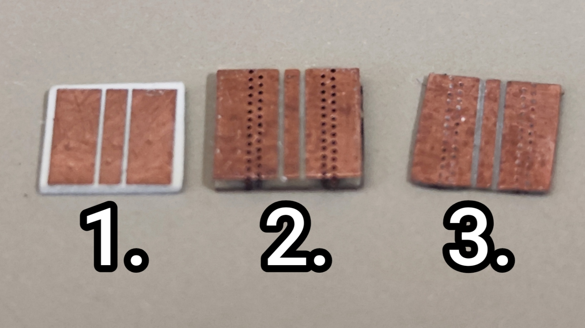

## Lab Log Book
* create this log book
* make it automatically include all log files in the directory

## Package Modes Experiments
1. I found the chip we looked for in the `IMPEDANCE MATCHING` box. its measurements are $5.75mm\times 6.1mm\times 0.4mm$. ($length\times width\times thickness$)
2. I measured the chips we have cut before, the measurements are: $6.2mm\times 6.2mm\times 1mm$. this chips where too thick so I sand it.
3. The measurements of the sanded chip is $6.2mm\times 6mm\times 0.35mm$. (I have send it from the sides as well)

 