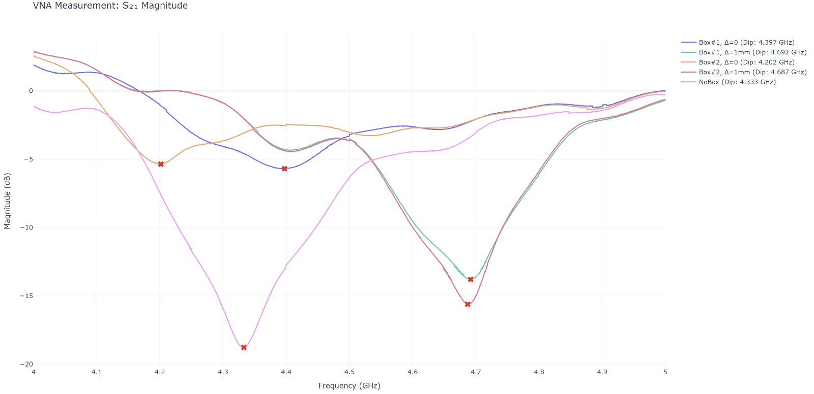

## Wire Bonding
I received training from Adi on how to use the wire bonder.  
I bonded the waveguide using aluminum wires: 2 wires on each side of the signal line and 15 wires for the ground plane (I intended to bond 16 for the ground, but one bond failed).

## VNA Calibration
I calibrated the LiteVNA using all 5 calibration steps:
1. **OPEN** - nothing connected to the ports.
2. **SHORT** - a short terminal connected to PORT1 (PORT2 floating).
3. **LOAD** - a $50\Omega$ resistor connected to PORT1 (PORT2 floating).
4. **ISOLN** - $50\Omega$ resistors connected to each port.
5. **THRU** - around 40cm long SMA cable was connecting both ports.

All connections were tightened using an SMA wrench.

## Measurements
Inspired by the study on package modes in [arXiv:1906.05425](https://arxiv.org/pdf/1906.05425), I tested all possible orientations of the housing components. Specifically, I compared configurations where the chip sits on a flat surface versus those with a recess (cavity) beneath the board.

To communicate with the LiteVNA, I used the [NanoVNA Server](https://github.com/joernt/NanoVNA-Server) software. 
All measurements were performed using **10 segments** per sweep, with each segment containing **201 linearly spaced points**, resulting in a high-resolution trace of **2010 points total**.

### Experimental Setup & Orientations
I used two "top" parts of the shielding boxes to create different housing environments. I used one as the top cover and the other as the bottom base, and then swapped their positions for further testing. For each base configuration, I assembled the part in two ways:
*   **Grooves facing inside ($\Delta=1mm$):** This creates a recess (cavity) under the PCB.
*   **Grooves facing outside ($\Delta=0mm$):** The flat surface of the plate touches the PCB directly.

This resulted in **4 distinct orientations** for the box. I also performed a baseline measurement of the waveguide without the box for comparison.

### Frequency Bands Measured
For every configuration (including the "no box" case), I performed the following sweeps:
*   **0.5 GHz – 6.3 GHz**: Broad scan to cover the full range of the LiteVNA.
*   **4.0 GHz – 5.0 GHz**: High-resolution scan targeting the identified resonance dip.

Additionally, I performed specific high-resolution sweeps for different recess depths to capture localized behavior:
*   **$\Delta=0mm$ orientations**: Additional measurements were taken in the 4.06 GHz – 4.46 GHz range.
*   **$\Delta=1mm$ orientations**: Additional measurements were taken in the 4.48 GHz – 4.88 GHz range.

Observations:
*   Unexpectedly, significant dips were observed even when measuring without the shielding box (shown in pink).
*   While the results differ slightly from the referenced paper, there is a clear distinction between the flat-bottom orientations (blue and yellow traces) and the configurations involving a recess under the board (green and red traces).

