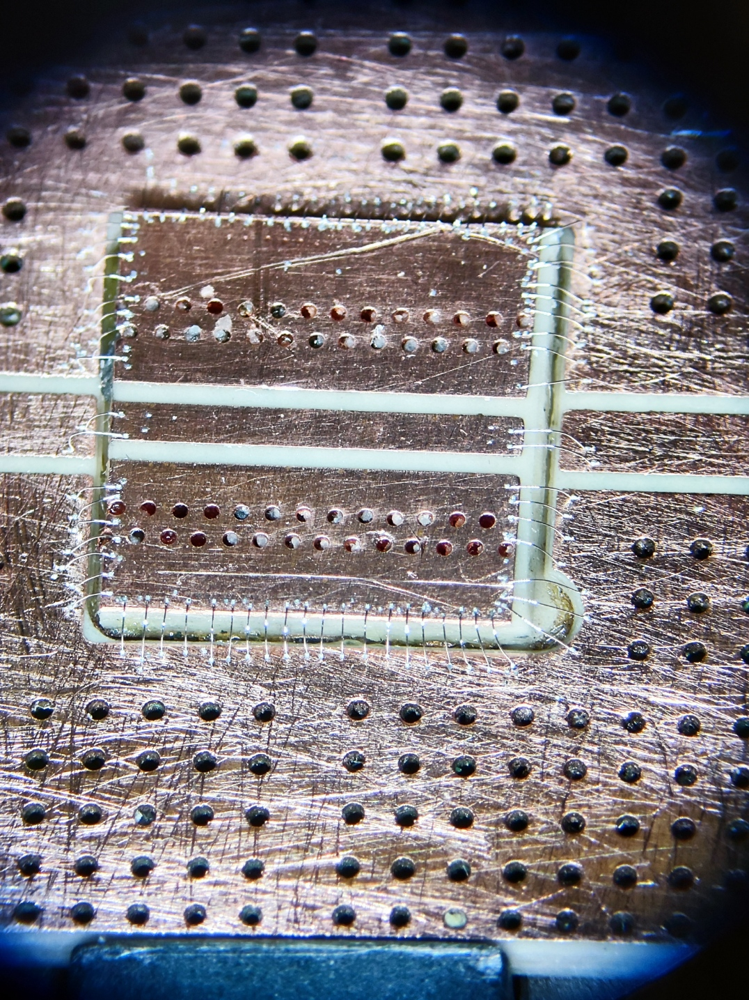
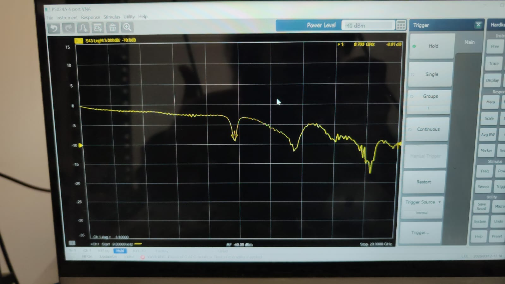

## Impedance Matching Issues & Rework
### Meeting with Prof. Nadav
I presented the results from yesterday's measurements to Nadav. He noted that the observed behavior suggests an **impedance mismatch**. Potential causes identified:
* **Insufficient Grounding:** The 15 wire bonds used for the ground plane might not be enough.
* **Substrate Modification:** Sanding the bottom of the chip (Chip #3) may have altered its impedance.
* **Initial Design:** The impedance might have been mismatched from the start.

**Guidelines for next steps:**
1.  Gain deeper mastery of microwave engineering and impedance matching.
2.  **Cleaning Technique:** Use a standard eraser to clean copper boards instead of sandpaper (which scratches the surface and prevents the bonder from adhering).
3.  **Custom Housing:** Design and manufacture a dedicated box in the workshop that properly fits the setup.

### Rework & Bonding
Following the discussion, I attempted to add more ground bonds to the previous setup, but the copper surface was too scratched from the sandpaper for the aluminum wires to catch. 

I switched to **Chip #2** (from [10/03 log](log_2026-03-10.md)) which was not sanded. I successfully performed the wire bonding for this chip.

### Measurements
I measured the new setup (Chip #2) using the LiteVNA. All measurements today were performed **without the shielding box**.
* **Observation:** The resonance dip previously seen at 4.4 GHz disappeared.
* **New Resonance:** A new resonance dip was observed around **9.7 GHz**.

Data was not saved for these runs, except for the following visual captures:
* `2026-03-12_chip2_bonding.jpg`: Image of the new wire bonds.
* `2026-03-12_chip2_VNA.png`: S21 analysis showing the resonance in chip #2.

Assuming FR-4 board, $\epsilon_{eff} \approx 4.4$:

| Frequency ($f$) | $\lambda_{eff} = \frac{c}{f\sqrt{\epsilon_{eff}}}$ | $l = \frac{\lambda_{eff}}{2}$ |
| :--- | :--- | :--- |
| 9.7 GHz | 14.73 mm | 7.37 mm |
| 13.5 GHz | 10.59 mm | 5.29 mm |
| 18.3 GHz | 7.81 mm | 3.90 mm |

